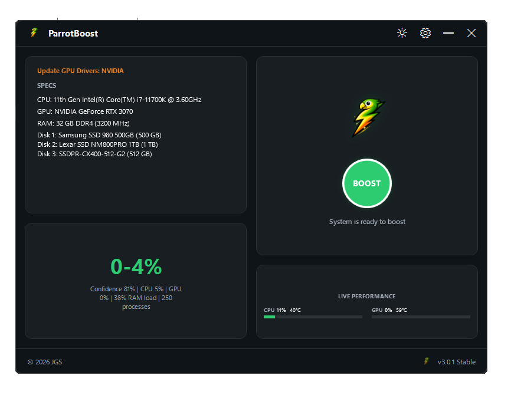
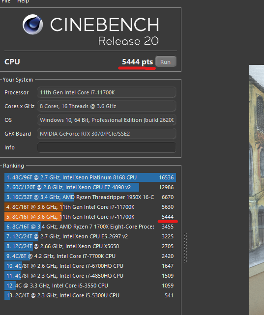
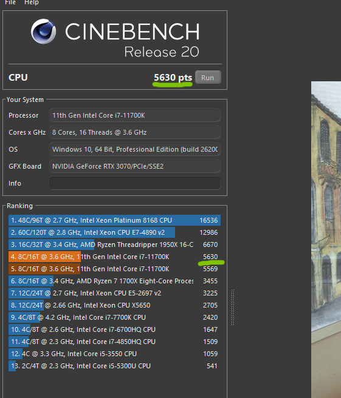

  

   

  

   

  
  
  
  

## 🚀 About ParrotBoost

**ParrotBoost** is a powerful optimization tool designed specifically for **Windows 10 and 11**. Our goal is simple: to make your computer run faster, smoother, and more efficiently. Whether you are a gamer looking for every single FPS or a power user needing a responsive system, ParrotBoost has you covered.

### Key Features (v3.0.1):

- **Zero-Footprint Telemetry:** Re-engineered CPU/GPU metric monitoring based on native Win32 APIs and LibreHardwareMonitor. 0-1% idle CPU consumption.
- **Privacy & Microsoft Resource Guard:** Stops Windows Delivery Optimization from using your PC and network bandwidth to upload updates to other computers (P2P WUDO upload blocked). Disables background Microsoft Compatibility Appraiser and telemetry scheduled tasks.
- **Extended System Cleaning:** Cleans browser cache (Chrome, Edge, Firefox, Brave, Opera), thumbnail databases, Windows Error Reporting dumps, setup logs, and provides an instant RAM cleaner.
- **Seamless Auto-Updates:** Checks for new releases directly from GitHub Releases on startup with one-click Inno Setup elevated updater.
- **Turbo Parrot Power Plan:** Maximum performance power plan hand-tuned for low latency and high responsiveness.
- **Service & Task Optimization:** Automatically disables unnecessary Windows background bloatware and services.

## 🖥️ App Preview

  
   
  <i>ParrotBoost v3.0.1 — Main Dashboard</i>

---

## 📊 Performance Impact

See the difference for yourself. Our "Boost" mode aggressively targets system latency and background noise.

| Before Optimization | After Optimization |
| :---: | :---: |
|  |  |
| *Standard Windows Bloat* | *Pure Performance* |

## 🛠️ Installation & Usage

### Recommended Way

1. Download the latest **ParrotBoost Installer** (`ParrotBoost-Setup-x64.exe`).
2. Run the installer as Administrator.
3. Launch ParrotBoost and enjoy optimal system performance.

### Portable & Source Code

If you prefer to run the app without installation or want to inspect the logic, the full source code is available here on GitHub.

## 🛡️ Security & Trust

ParrotBoost is open-source, transparent, and built to empower users with maximum PC performance.

## 💬 Feedback & Publisher

Publisher: **JGS**  
Maintained by **JGS team**.
