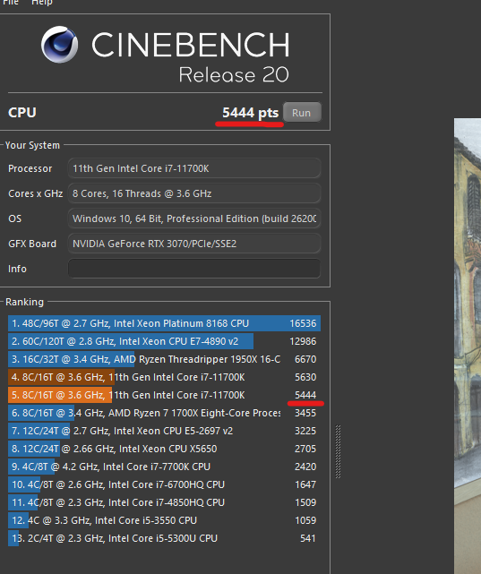
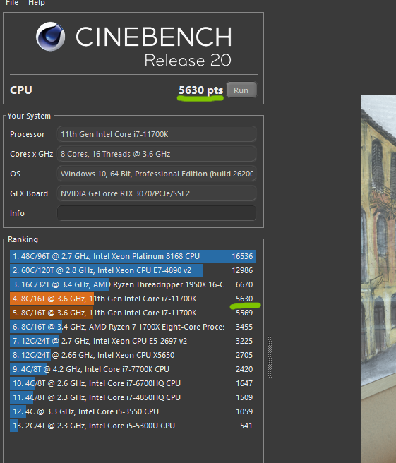

  

   

  

   

  
  
  
  

## 🚀 About ParrotBoost

**ParrotBoost** is a powerful optimization tool designed specifically for **Windows 10 and 11**. Our goal is simple: to make your computer run faster, smoother, and more efficiently. Whether you are a gamer looking for every single FPS or a power user needing a responsive system, ParrotBoost has you covered.

### Key Features:

**Turbo Parrot Power Plan:** A custom-tailored maximum performance power plan, hand-tuned by our lead developer **Hnato**.

**Service Optimization:** Automatically disables unnecessary Windows services that hog your CPU and RAM.

**Deep Cleaning:** Advanced tools to clear cache and system junk from `%temp%`, `temp`, and `prefetch` folders.

**UI Customization:** Personalize the application's look to match your setup.

**Process Control:** Fully configurable settings, you decide which processes should remain untouched.

## 📊 Performance Impact

See the difference for yourself. Our "Boost" mode aggressively targets system latency and background noise.

| Before Optimization | After Optimization |
| :---: | :---: |
|  |  |
| *Standard Windows Bloat* | *Pure Performance* |

## 🛠️ Installation \& Usage

### Recommended Way

1.  Download the latest **ParrotBoost Installer**.

2.  **Important:** Right-click the installer and select **"Run as Administrator"**. This is required to modify power plans and system services.

3.  Follow the setup instructions and launch the app.

### Portable & Source Code

If you prefer to run the app without installation or want to inspect the logic, we provide a **portable version** and the **full source code** here on GitHub. We have also included our internal **compilation and testing tools** if you wish to rebuild ParrotBoost yourself! [Dev-kit-ParrotBoost](https://github.com/JGS-Parrotnest/Dev-kit-ParrotBoost)

> [NOTE]

> When activating **Boost Mode**, you might notice a temporary spike in resource usage. This is normal! The app is busy creating backups of your settings, deep-cleaning multiple directories, and managing services. We’ve optimized this process to be as fast as possible.

## 🛡️ Security & Trust

We know that system optimizers can sometimes look suspicious. **ParrotBoost is NOT a virus.** * All my developer data is public.

* The project is open-source. You can check every line of code.

* I started this project to provide high-quality optimization tools for free because I know what it’s like to need a performance boost when you can't afford expensive hardware.

## 💬 Feedback

We are constantly evolving! If you encounter any bugs or have ideas for new features, please provide **constructive criticism**. Your feedback is what allows this project to grow.

**Thank you for choosing ParrotBoost! Enjoy your faster PC!** 🦜🚀

*Maintained by **JGS team and ThomasWack**.*

